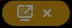

# IKSDP Desktop Linux Poweruser-Dokumentation

## USB-Stick für einen Nutzer erstellen

TODO

## Betriebssystem aktualisieren

TODO

```bash
mount -t nfs 192.168.200.1:/usb2-part1 /mnt
dd if=/mnt/smb/debian-live* of=/dev/nvme0n1 status=progress 
```

## Support erhalten über eine Rustdesk-Remote-Sitzung

### Eine Remote-Sitzung starten
1. Öffne die Anwendung **"Rustdesk"**, indem du die **"Windows"-Taste** drückst und dann **"Rustdesk"** eingibst.  
2. Klicken nun auf das **"Rustdesk"-Symbol**.  
  
3. Eine andere Möglichkeit, Rustdesk zu starten, besteht darin, die Anwendungsliste in der oberen Taskleiste zu öffnen und dann auf **"Internet"** und **"Rustdesk"** zu klicken.  
  
4. Nun sende die **"ID"** und das **"One-time Password"**, welche du auf der linken Seite siehst, an die Person, von der du Support erhalten möchtest.  
  
5. Ein kleines Fenster kann erscheinen, welches zeigt, dass ein Gerät sich mit deinem Computer verbinden möchte. Normalerweise wird die Verbindung automatisch hergestellt. Falls nicht, klicke auf den **"Accept"**-Button.  
  
6. Falls jemand das erste Mal eine Verbindung zu deinem Computer herstellt, musst du den Bildschirm auswählen, der freigegeben werden soll. Wähle nun den Bildschirm aus, setze das Häkchen bei **"Remember this selection"** und klicke auf **"Share"**.  
  
7. Wenn du das kleine Symbol in der oberen Taskleiste siehst, ist die Verbindung hergestellt.  
  

### Die Remote-Sitzung beenden
1. Bewege die Maus über das **"Rustdesk"-Symbol** in der linken Seitenleiste. Nun sollten zwei kleinere Fenster neben der Seitenleiste erscheinen.  
2. Klicke auf das Fenster, das die aktive Verbindung anzeigt.  
  
3. Nun sollte das **"Verbindungsfenster"** auf dem Bildschirm erscheinen.  
4. Klicke nun auf **"Disconnect"**, um die Remote-Sitzung zu beenden.  
  
5. Das kleine Symbol in der oberen Taskleiste  sollte nun verschwunden sein, was bedeutet, dass die Verbindung für das Remote-Gerät geschlossen wurde.