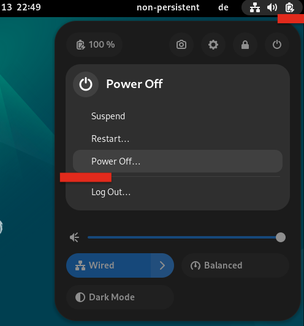

# IKSDP Benutzerdokumenation

## Zielgruppe des Dokumentes

Dieses Dokument wendet sich and Benutzer des IKSDP Desktop Linux. Dieses Betriebssystem ist ein Live Linux System, welches 2 unterschiedliche Betriebmodi unterstützt.

## Starten des Systems

Bei starten des Systems sehen sie folgenden Bildschirm. 

Es ist "Live system (amd64)" vorausgewählt. Wenn du kein USB Stick an das System anschliesst, wird das System im nicht persistenten Modus starten. Wenn du eine vorbereiteten USB Stick anschliesst, startet das system im persistenten Modus. 

Wenn der USB-Stick nach der Bootauswahl angesteckt wird, so bleibt er im nicht-persistenten Modus. das System muss neugestartet um in den persisteten Modus zu wechseln.

### Nicht persistenter Modus

Dieser Modus ist der standardmodus. Er ist daran zu erkennen, dass rechts oben im Desktop ein Eintrag "non-persistent" dargestellt ist. 

In diesem Modus können Änderungen am system vorgenommen werden, allerdings werden diese Änderungen nach dem Neustart des Systems komplett gelöscht.

Sollten sie während einer Benutzersitzung Dateien erzeugen, welche sie später weiterbearbeiten möchten, so müssen diese auf einem mobilen Speicher wie usb-stick, Handy oder einem Clouddienst gespeichert werden. 

### persistenter Modus 

In diesem Modus werden Änderungen des Benutzers auf einem speziell vorbereiteten USB Stick gespeichert. Somit bleiben Benutzereinstellungen in Programmen wie Bookmarks in Browser, Dateien anders als im nicht-persistent Modus auch beim neustart des Systems erhalten.

Der USB Stick darf im persistenten Modus nicht vom System entfernt werden, andernfalls droht ein Datenverlust.

## Installation von weiterer Software

Es kann weitere Software installiert werden. Im nicht-persistenten Modus muss dies nach jedem Systemstart erneut erfolgen. Wenn Software dauerhaft der Installation hinzugefügt werden soll benachrichtigen sie bitte ihren lokalen Ansprechpartner am IKSDP. Er kann die Installation für sie veranlassen.

Wählen sie "System Tools" -> "Software"

suchen sie nach der Software und wählen sie aus:

installieren sie die Software - unter der Software sollte "Flatpak" stehen.

Die Installation der Software kann je nach Größe etwas zeit beanspruchen. 

Sobald die Software fertig installiert ist, kann sie über "open" gestartet werden. 

## Runterfahren des Systems

Das System wird rechts oben über das Power symbol beendet. Wählen sie das Icon und "Power Off". Bestätigen sie anschliessend. 

