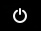

# IKSDP Desktop Linux Benutzer-Dokumenation

## Zielgruppe des Dokumentes

Dieses Dokument wendet sich an Benutzer des IKSDP Desktop Linux. Das Betriebssystem ist ein Live Linux System, welches zwei unterschiedliche Betriebsmodi unterstützt:  
- [nicht persistenter Modus](#nicht-persistenter-modus)  
- [persistenter Modus](#persistenter-modus)

Bereits vor dem Starten sollte man sich für ein Betriebsmodus entscheiden.

## Starten des Systems

Beim Starten des Systems siehst du folgenden Bildschirm.

Es ist "Live system (amd64)" vorausgewählt. Wenn du vor dem Start kein USB Stick an das System angeschlossen hast, wird das System im nicht persistenten Modus starten. Wenn du einen vorbereiteten USB Stick vor dem Start angeschlossen hast, dann startet das System im persistenten Modus.

Wenn der USB-Stick nach der Bootauswahl angesteckt wird, so bleibt das System im nicht-persistenten Modus. Das System muss neugestartet um in den persisteten Modus zu wechseln.

### Nicht-Persistenter Modus

Dieser Modus ist der Standardmodus. Er ist daran zu erkennen, dass rechts oben im Desktop ein Eintrag "non-persistent" dargestellt wird. 

In diesem Modus können Änderungen am System vorgenommen werden, allerdings werden diese Änderungen nach dem Neustart des Systems komplett zurückgesetzt.

Solltest du während einer Benutzersitzung Dateien erzeugen, welche du später weiterbearbeiten möchtest, so müssen diese Dateien auf einem mobilen Speicher wie einem USB-Stick, Handy oder einem Clouddienst gespeichert werden.

### Persistenter Modus 

In diesem Modus werden Änderungen des Benutzers auf einem speziell vorbereiteten USB Stick gespeichert. Somit bleiben Benutzereinstellungen in Programmen wie Lesezeichen im Browser, Dateien oder installierte Programme auch nach dem Neustart des Systems erhalten.

>**Der USB Stick darf im persistenten Modus nicht vom System entfernt werden, andernfalls droht ein Datenverlust!**

## Herunterfahren des Systems

Das System wird oben rechts über den "Power" Button  beendet. Klicke den "Power" Button und anschließend auf "Power Off..."  

Jetzt öffnet sich ein "Power Off" Dialog. Dort auf den Button "Power Off" drücken um das System herunterfahren.  

## Installation von weiterer Software

Es besteht die Möglichkeit weitere Software zu installieren. Im nicht-persistenten Modus muss dies nach **jedem Systemstart erneut erfolgen**. Wenn Software dauerhaft der Installation hinzugefügt werden soll benachrichtige bitte deinen lokalen Ansprechpartner vom IKSDP. Er kann die Installation für dich veranlassen.

Wähle "System Tools" > "Software"

Suche anschließend nach der Software und wähle sie aus: In diesem Beispiel suchen wir nach einer Internetradio Anwendung.

Installiere die Software indem du den "Install" Button klickst. 
Unter dem "Install" Button sollte "Flatpak" stehen.

Die Installation der Software kann je nach Größe etwas Zeit beanspruchen. Der aktuelle Fortschritt wird unter dem "Cancel" Button angezeigt. Soll die Installation abgebrochen werden kann der "Cancel" Button betätigt werden. 

Sobald die Software fertig installiert ist, kann sie über "Open" gestartet werden. 

