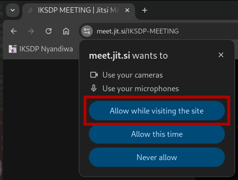
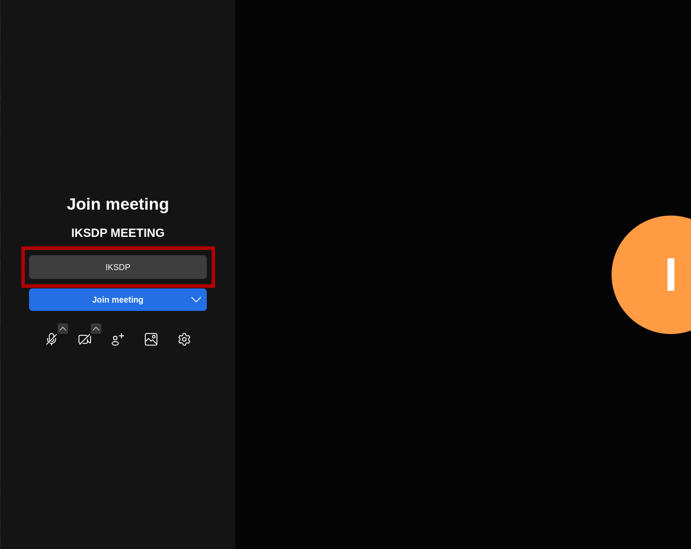
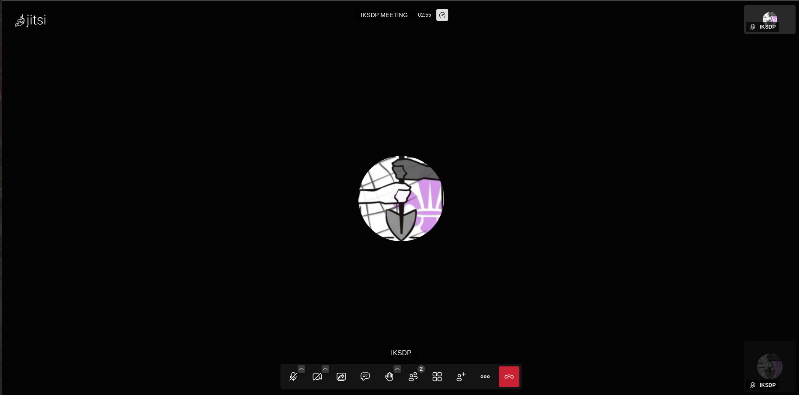

# Benutzeranleitung: Jitsi-Meeting im Browser erstellen und Teilnehmer einladen

## Allgemeines
Jitsi ist eine kostenlose, quelloffene Videokonferenzlösung, die direkt im Browser genutzt werden kann. Damit kannst du ganz einfach Online-Meetings erstellen. Jitsi bietet Funktionen wie Bildschirmfreigabe, Chat und die Möglichkeit, Meetings mit einem Passwort zu sichern. Für das Erstellen eines Meetings muss eine Anmeldung erfolgen. Die weiteren Teilnehmer können ohne ein Konto dem Meeting beitreten.

## 1. Ein Jitsi-Meeting starten

### Schritt 1: Jitsi Meet aufrufen
1. Öffne deinen Webbrowser (z.B. Google Chrome, Mozilla Firefox, Microsoft Edge).
2. Gehe auf die Jitsi Meet-Website: [https://meet.jit.si](https://meet.jit.si)

### Schritt 2: Neues Meeting erstellen
1. Auf der Startseite siehst du ein Feld mit einem generierten Meeting Namen.

2. Gib dort einen eindeutigen Namen für dein Meeting ein (z. B. „IKSDP-MEETING“).

3. Klicke auf **„Start Meeting“** oder drücke die **Enter-Taste**.

### Schritt 3: Browserberechtigungen erteilen
1. Wenn du zum ersten Mal ein Jitsi-Meeting nutzt, wird dein Browser nach Zugriff auf **Mikrofon und Kamera** fragen.
2. Erlaube den Zugriff, damit du an der Videokonferenz teilnehmen kannst.

### Schritt 4: Name festlegen und Meeting beitreten
1. Du siehst nun eine Eingabebox in der du deinen Namen eintippst.

2. Anschließend kannst du noch Mikrofon  und Kamera  an- bzw. ausschalten.
3. Klicke auf den Button "Join Meeting" um der Videokonferenz beizutreten  

### Schritt 5: Login durchführen (nur als Ersteller notwendig)
1. Du wirst nun gebeten dich einzuloggen um das Meeting zu starten.
2. Klicke auf "Log-in"  

3. Du kannst zwischen verschiedenen Login Anbietern wählen. Wir nutzen in diesem How-To den Google Account. Klicke auf den Button "Sign in with Google"   

4. Klicke auf deinen Account. Falls kein Account bereits angemeldet wurde, dann musst du dich erstmalig mit deinem Google Konto anmelden.  

5. Klicke nun auf den Button "Continue".  

6. Du solltest nun erfolgreich eingeloggt werden und die Videokonferenz sollte gestartet sein.  

---

## 2. Teilnehmer einladen

### Schritt 1: Meeting-Link teilen
1. Klicke unten rechts auf das **„Personen einladen“-Symbol**

2. Ein Pop-up-Fenster erscheint mit dem **Meeting-Link**.
3. Kopiere diesen Link und teile ihn per **E-Mail, Messenger oder andere Chat-Tools**.  

---

## 3. Während des Meetings

### Mikrofon und Kamera steuern:
- **Mikrofon stummschalten**: Klicke auf das **Mikrofonsymbol** unten.
- **Kamera ausschalten**: Klicke auf das **Kamerasymbol** unten.

### Bildschirmfreigabe:
1. Klicke auf das **Bildschirmfreigabe-Symbol**
2. Wähle, ob du deinen gesamten Bildschirm, ein Fenster oder einen Tab teilen möchtest.
3. Klicke auf **„Teilen“**.

### Meeting beenden:
- Klicke auf das **rote Telefon-Symbol**, um das Meeting zu verlassen oder zu beenden.

---

## Zusätzliche Tipps
- Nutze den **Chat** (unten links) für Notizen oder Links.
- Falls es Verbindungsprobleme gibt, kann ein Wechsel zu **Google Chrome** helfen.
