# IKSDP Desktop Linux Power User Documentation  

- we can choose if to encrypt the stick or not, **if the USB stick is encrypted and the password is lost, access to the documents on the stick is completly lost**

- start the shell script
- open "terminal": e.g.:  Applications -> Utilities -> Terminal
```bash
su - 
```
- enter superuser password

```
/opt/iksdp/bin/create-usb-stick.sh
```
- he will prompt to select the device to prepair
- choose the highest number
- "do you want to proceed" -> y
- "do you want to unmount" -> y
- "Enter size for the first partition in MB" -> default..
- do you want to encrypt the second partition? -> please choose
- proceed anyway -> y 

## Update the Operating System  

### Download latest image and copy to central storage

- on the running iksdp os
- download the newest image (.hybrid.iso) from the distribution share [http://iksdp.pfadfinderzentrum.org](http://iksdp.pfadfinderzentrum.org)
- get connection to storage on router
- open terminal -> windows key -> type "terminal"
- enter:

```bash
su - 
mount -t nfs 192.168.200.1:/usb2-part1/smb /mnt
```
- copy the downloaded image file to /mnt


### Update possibility 1: Update using the network

- start the pc to update and hit "Delete" Button - at black screen and hit delete multiple times.
- use keyboard to select boot and ensure "Network UEFI:.." is selected as Boot Option #1

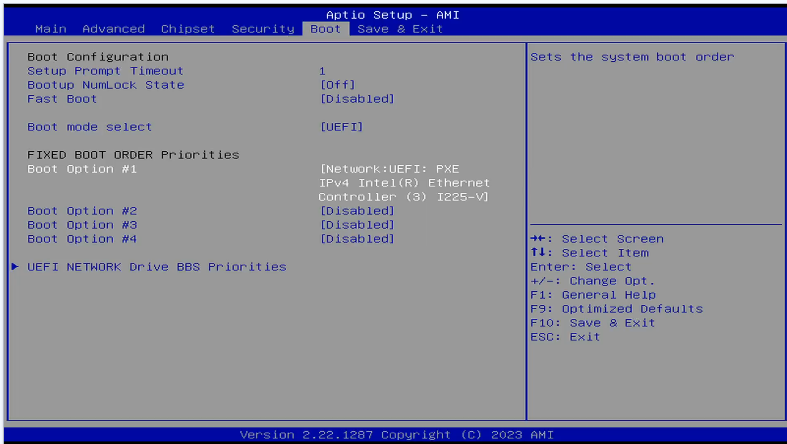

- select save+exit -> save settings and exit

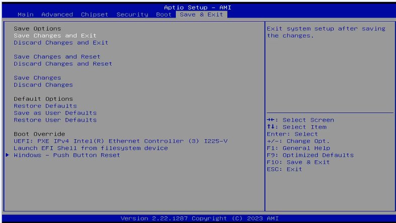

- this screen might occur.. reboot at this step and hit F7 after boot

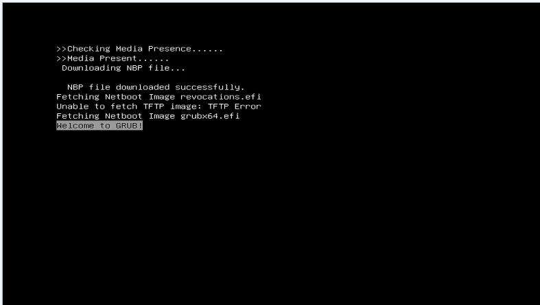

- this is the correct bootscreen hit enter

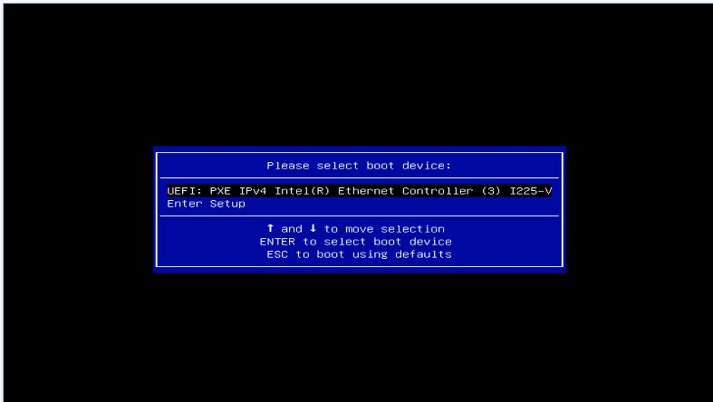

- select "Upgrade IKSDP"

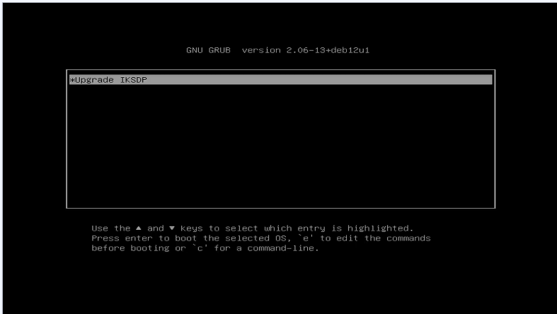

- when updater is started completely it will look like this

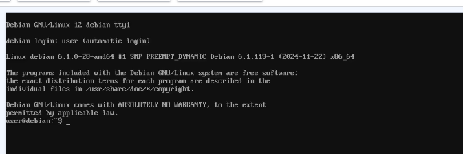


- enter the folling commands to connect to central storage and attach it to the /mnt directory

```bash
sudo bash
mount -t nfs 192.168.200.1:/usb2-part1/smb /mnt
```

- correct output will be something like this

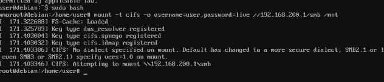

- copy the image using the dd command to the NVME Harddisk of the pc - **ensure your image name is correct**

```bash
dd if=/mnt/debian-live-bookworm-0.5.0-20250313055721-amd64.hybrid.iso of=/dev/nvme0n1 status=progress
```

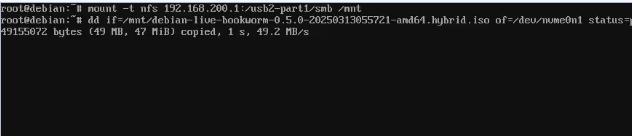

- run reboot command

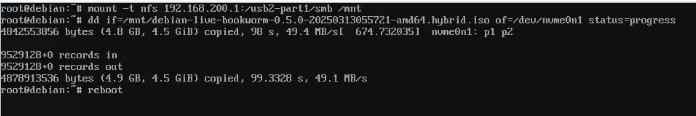

- enter BIOS setup using the Delete button at start

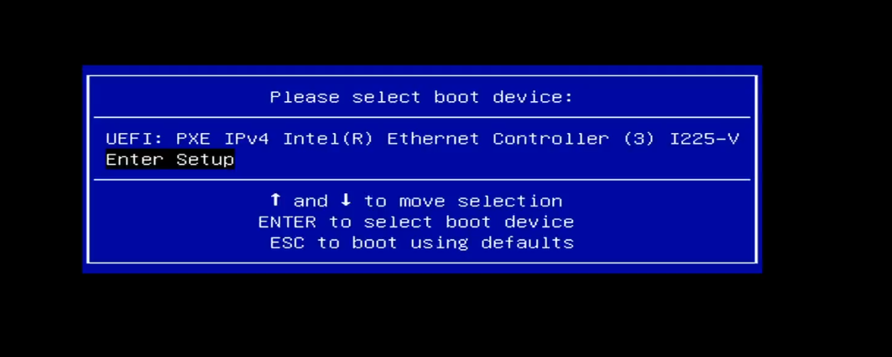

- select boot and ensure "NVME" is selected as Boot Option #1

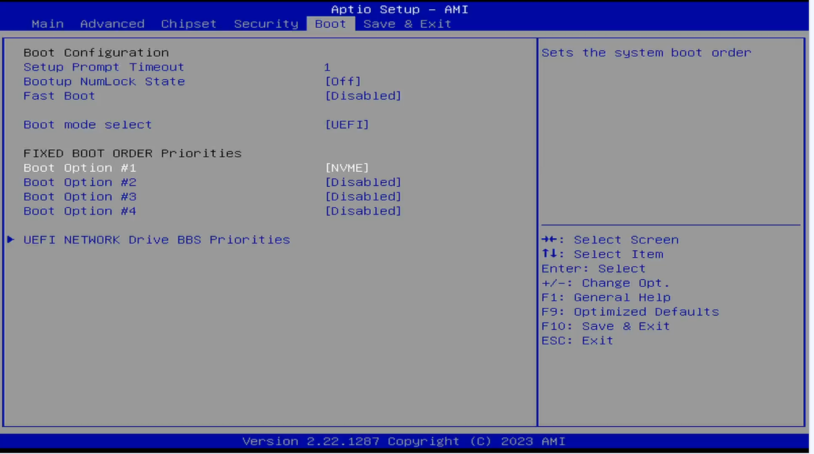

- select save+exit -> save settings and exit


- check that image have a higher version now

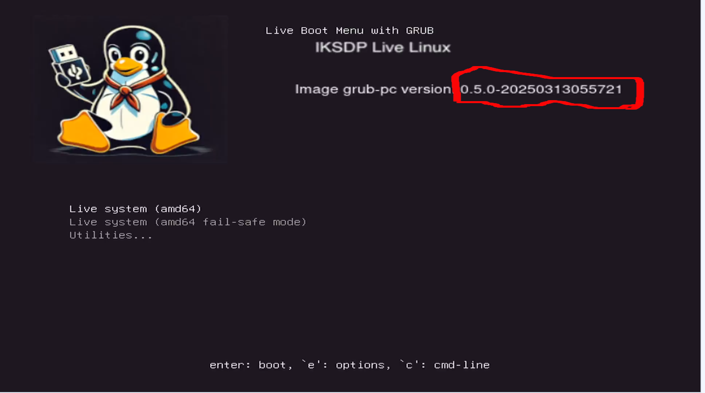

- Done


### Update possibility 2: use USB Stick

#### ensure usb boot is enabled

- start the pc to update and hit "Delete" Button - at black screen and hit delete multiple times.
- use keyboard to select boot and ensure **"USB"** is selected as Boot Option #1

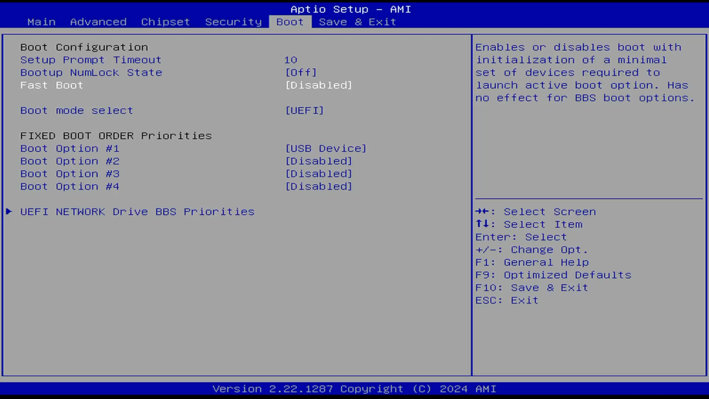

- press F10 to save & exit
- reboot the PC


#### always
- enter special usb update stick
- select "try or install ubuntu"

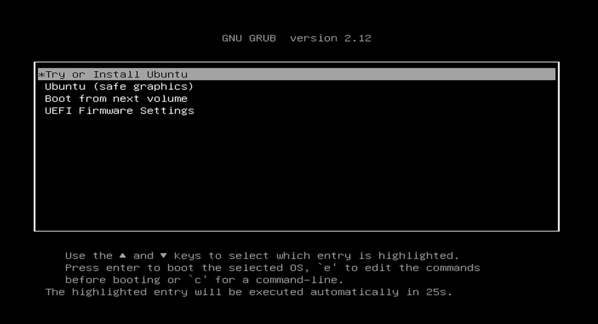

- wait for the "Welcome to Ubuntu" to start fully
- when "choose your language" appears you can close the windows using the X

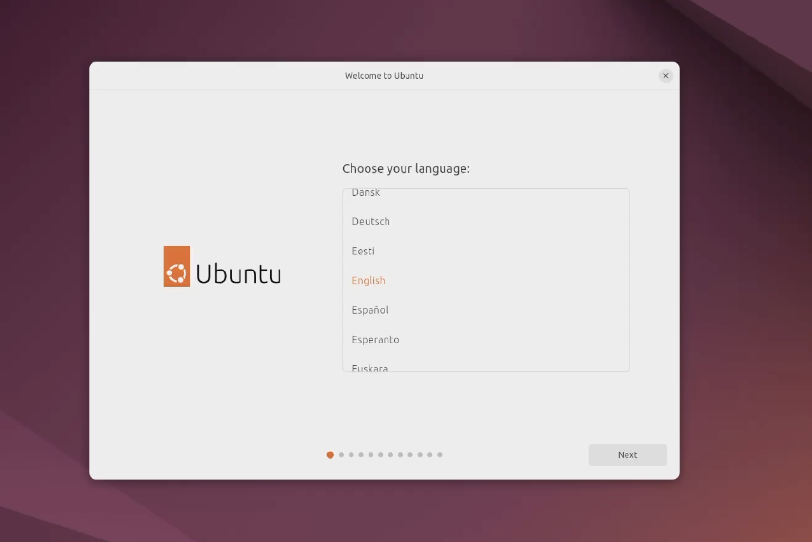

- start "terminal"

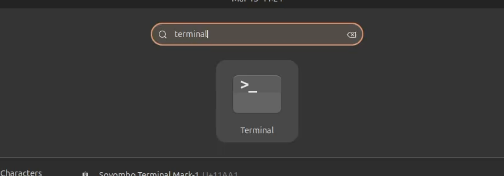


- run commands to connect to central storage
```bash
sudo bash
mount -t cifs -o username=user,password=live //192.168.200.1/smb /mnt
```

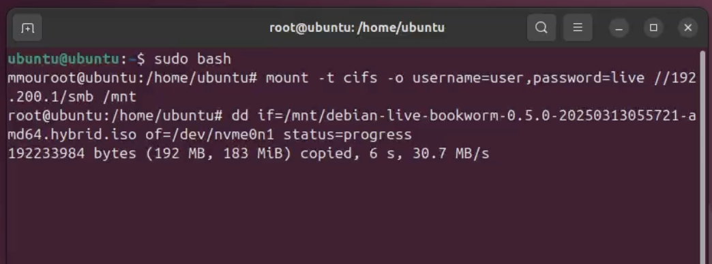


- update nvme harddisk using the commands
```bash
dd if=/mnt/debian-live-bookworm-0.5.0-20250313055721-amd64.hybrid.iso of=/dev/nvme0n1 status=progress
```

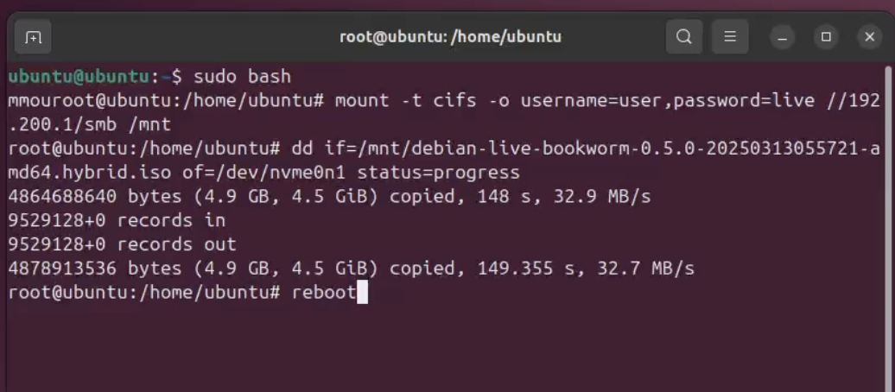


- type "reboot"
- pull out update stick and press enter when prompted

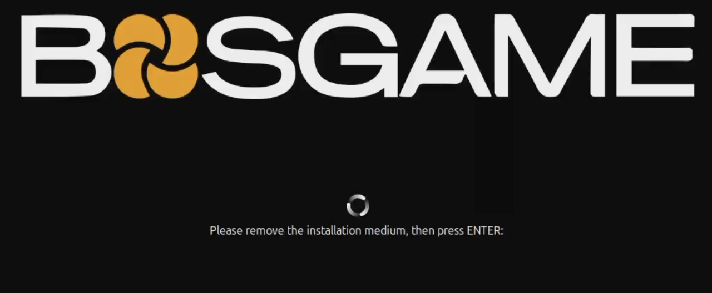

- check that image have a higher version now


## Support via Rustdesk Remote Session

### Establish a Remote Session
1. Open the application **"Rustdesk"** by pressing **"Windows"-Key** and then start typing **"Rustdesk"**.  
2. Now click the **"Rustdesk"-Icon**.  
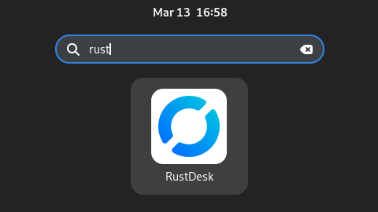
3. A different way to start Rustdesk would be by opening the Applications Tab in the taskbar at the top and then click on **"Internet"** and **"Rustdesk"**.  
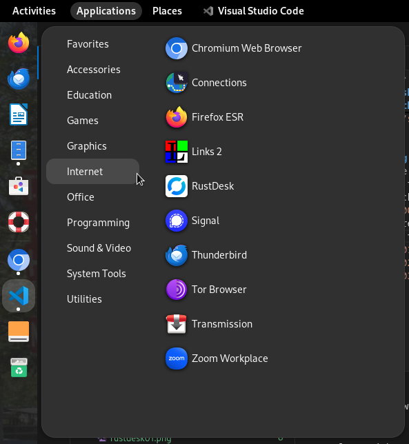
4. Now you will send the **"ID"** and the **"One-time Password"** which you can see on the left side to the person you want to receive Support from.  
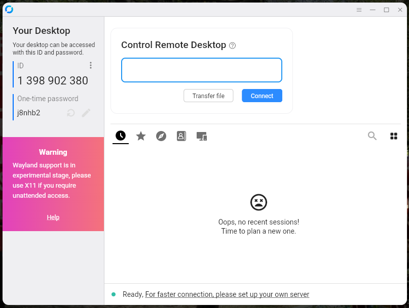
5. A small window might appear which shows that a device wants to connect to your Computer. Normally the connection gets automatically established. If not, click the **"Accept"** Button.  
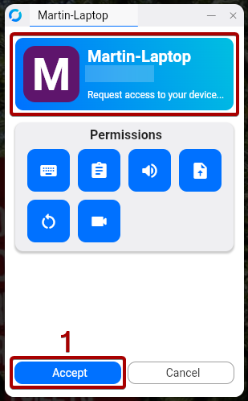
6. If its the first time someone connects to your Computer then you will have to select the screen which should be shared. Select the screen, tick the box **"Remember this selection"** and then click **"Share"**.  
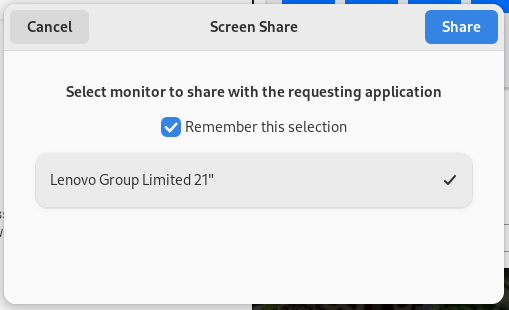
7. If you see this little icon in the top taskbar, then the connection is established.  
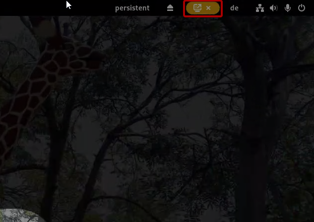

### Stop the Remote Session
1. Move your mouse over the **"Rustdesk"-Icon** in the left sidebar. Now two smaller windows should appear next to the sidebar.  
2. Click on the window which shows the active connection.  
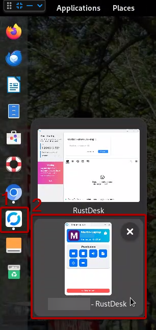
3. Now the **"Connection"-Window** should appear on the screen.
4. Click **"Disconnect"** to end the remote session.  
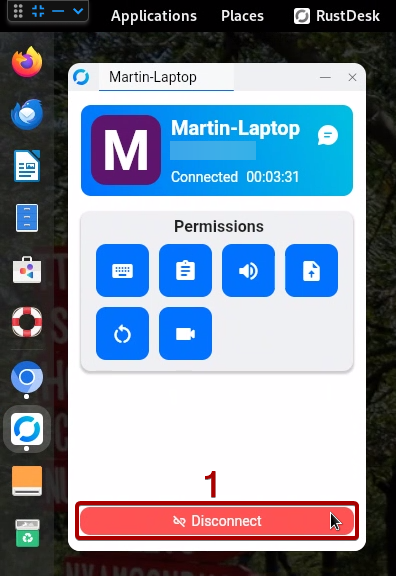
5. The small icon in the top taskbar 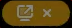 should now be disappeared, which means the connection is closed for the remote device.