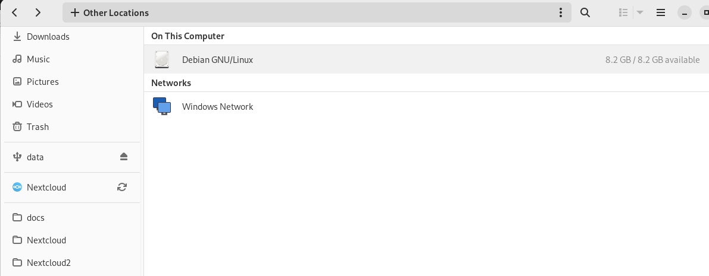
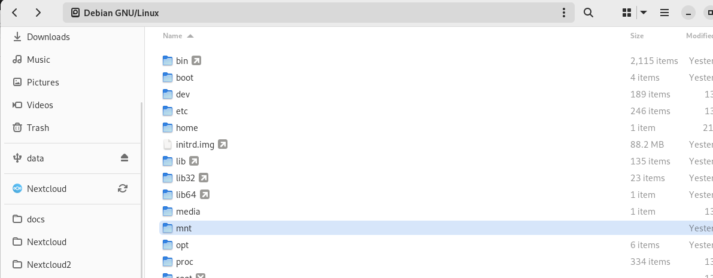
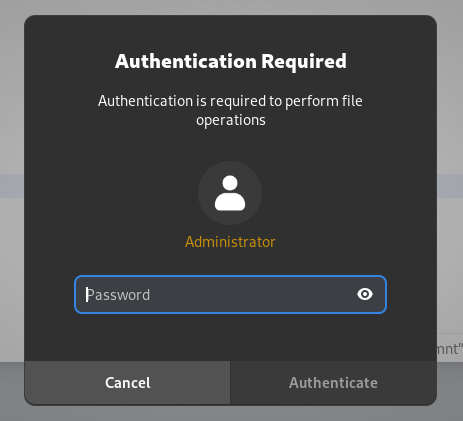
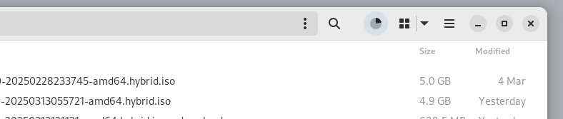
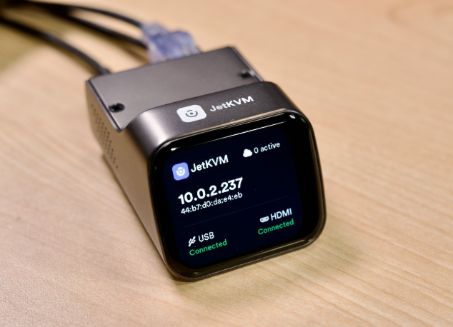

# IKSDP Desktop Linux Power User Documentation  

- we can choose if to encrypt the stick or not, **if the USB stick is encrypted and the password is lost, access to the documents on the stick is completly lost**

- start the shell script
- open "terminal": e.g.:  Applications -> Utilities -> Terminal
```bash
su - 
```
- enter superuser password

```
/opt/iksdp/bin/create-usb-stick.sh
```
- he will prompt to select the device to prepair
- choose the highest number
- "do you want to proceed" -> y
- "do you want to unmount" -> y
- "Enter size for the first partition in MB" -> default..
- do you want to encrypt the second partition? -> please choose
- proceed anyway -> y

TODO  

## Update the Operating System  

### Download latest image and copy to central storage

- download the newest image (.hybrid.iso) from the distribution share [http://iksdp.pfadfinderzentrum.org](http://iksdp.pfadfinderzentrum.org)
- to get connection to storage on router
- open terminal -> windows key -> type "terminal"
- enter:

```bash
su - 
mount -t nfs 192.168.200.1:/usb2-part1/smb /mnt
```
- to copy the downloaded image file to /mnt




- /mnt is show in "other Locations" -> Debian GNU/Linux



- you will need to type superuser password twice



- indicator will show status of the copy job




### Update possibility 1: Update using the network

- start the pc to update and hit "Delete" Button - at black screen and hit delete multiple times.
- use keyboard to select boot and ensure "Network UEFI:.." is selected as Boot Option #1


- select save+exit -> save settings and exit


- this screen might occur.. reboot at this step and hit F7 after boot


- this is the correct bootscreen hit enter


- select "Upgrade IKSDP"


- when updater is started completely it will look like this


- enter the folling commands to connect to central storage and attach it to the /mnt directory

```bash
sudo bash
mount -t nfs 192.168.200.1:/usb2-part1/smb /mnt
```

- correct output will be something like this


- copy the image using the dd command to the NVME Harddisk of the pc - **ensure your image name is correct**

```bash
dd if=/mnt/debian-live-bookworm-0.5.0-20250313055721-amd64.hybrid.iso of=/dev/nvme0n1 status=progress
```


- run reboot command


- enter BIOS setup using the Delete button at start


- select boot and ensure "NVME" is selected as Boot Option #1


- select save+exit -> save settings and exit


- check that image have a higher version now


- Done


### Update possibility 2: use USB Stick

#### ensure usb boot is enabled

- start the pc to update and hit "Delete" Button - at black screen and hit delete multiple times.
- use keyboard to select boot and ensure **"USB"** is selected as Boot Option #1


- press F10 to save & exit
- reboot the PC


#### always
- enter special usb update stick
- select "try or install ubuntu"


- wait for the "Welcome to Ubuntu" to start fully
- when "choose your language" appears you can close the windows using the X


- start "terminal"


- run commands to connect to central storage
```bash
sudo bash
mount -t cifs -o username=user,password=live //192.168.200.1/smb /mnt
```


- update nvme harddisk using the commands
```bash
dd if=/mnt/debian-live-bookworm-0.5.0-20250313055721-amd64.hybrid.iso of=/dev/nvme0n1 status=progress
```


- type "reboot"
- pull out update stick and press enter when prompted


- check that image have a higher version now


## Remote Support Using JetKVM  

There might be situations where the support team needs to connect directly to a local computer.  
For this reason, a JetKVM device has been set up.  

  

The device must be connected via USB to the computer, and an HDMI cable must be connected from the JetKVM to the PC. Because of this setup, no output will be visible on the screen while the device is connected. Additionally, the JetKVM must be connected to a switch port in the lab, specifically on ports 2–8. Other devices, such as the printer, must be temporarily disconnected.  

The support team will connect to the JetKVM device via VPN or cloud access.  

On the local network, the device is accessible at [http://192.168.200.20](http://192.168.200.20).  


