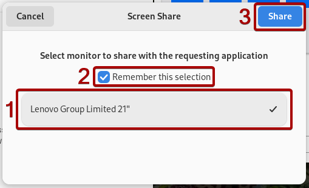

# IKSDP Desktop Linux Power User Documentation  

- we can choose if to encrypt the stick or not, **if the USB stick is encrypted and the password is lost, access to the documents on the stick is completly lost**

- start the shell script
- open "terminal": e.g.:  Applications -> Utilities -> Terminal
```bash
su - 
```
- enter superuser password

```
/opt/iksdp/bin/create-usb-stick.sh
```
- he will prompt to select the device to prepair
- choose the highest number
- "do you want to proceed" -> y
- "do you want to unmount" -> y
- "Enter size for the first partition in MB" -> default..
- do you want to encrypt the second partition? -> please choose
- proceed anyway -> y

TODO  

## Update the Operating System  

TODO

```bash
mount -t nfs 192.168.200.1:/usb2-part1 /mnt
dd if=/mnt/smb/debian-live* of=/dev/nvme0n1 status=progress 
```

## Support by a Rustdesk Remote Session
1. Open the application **"Rustdesk"** by pressing **"Windows"-Key** and then start typing **"Rustdesk"**. 
2. Now click the **"Rustdesk"-Icon**  

3. A different way to start Rustdesk would be by opening the Applications Tab in the taskbar at the top and then click on **"Internet"** and **"Rustdesk"**  

4. Now you will send the **"ID"** and the **"One-time Password"** which you can see on the left side to the person you want to receive Support from.  

5. A small window might appear which shows that the person wants to connect to your Computer.  

6. If its the first time someone connects to your Computer then you will have to select the screen which should be shared. Select the screen and then click **"Share"**
