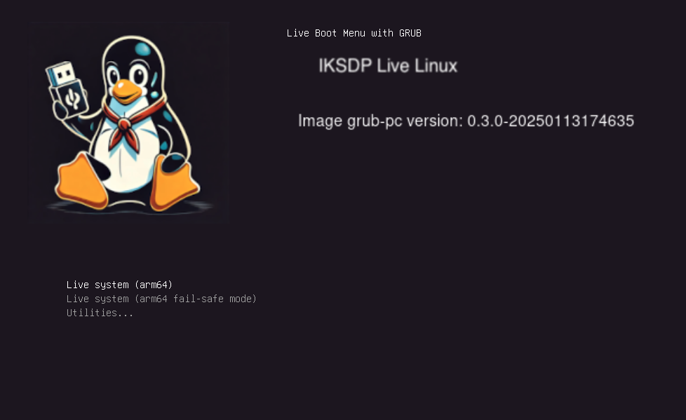
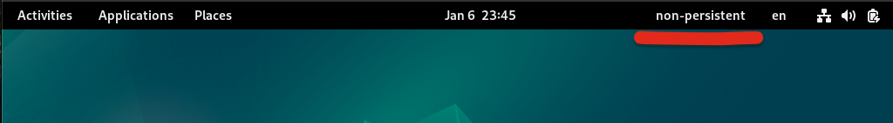
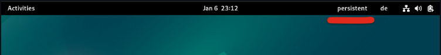
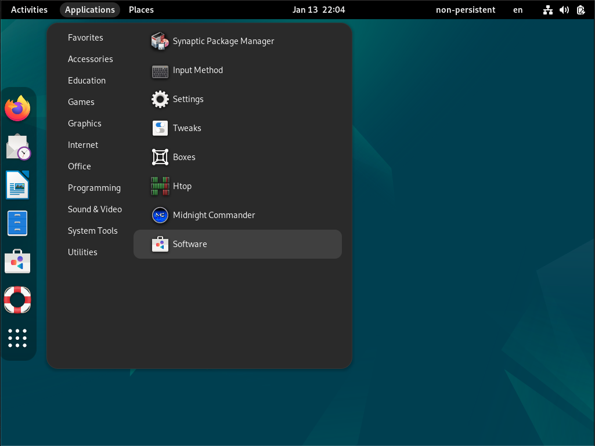
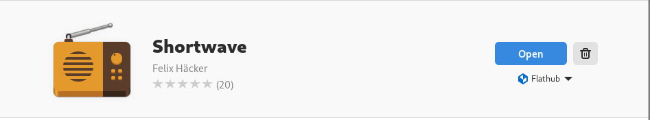
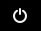
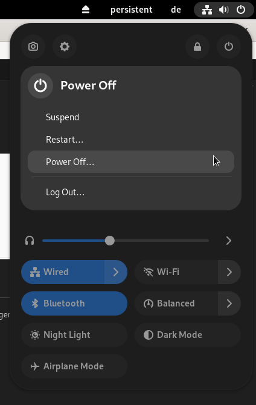

# IKSDP Desktop Linux User Documentation  

## Target Audience of the Document  

This document is intended for users of IKSDP Desktop Linux. The operating system is a live Linux system that supports two different operating modes:  
- [Non-persistent mode](#non-persistent-mode)  
- [Persistent mode](#persistent-mode)  

You should decide on an operating mode before starting the system.  

## Starting the System  

When starting the system, you will see the following screen:  

  

"Live system (amd64)" is preselected. If no USB stick is connected to the system before startup, the system will start in non-persistent mode. If you have connected a prepared USB stick before startup, the system will start in persistent mode.  

If the USB stick is inserted after selecting the boot option, the system will remain in non-persistent mode. The system must be restarted to switch to persistent mode.  

### Non-Persistent Mode  

This is the default mode. You can recognize it by the "non-persistent" label displayed in the top-right corner of the desktop.  

  

In this mode, changes to the system can be made, but they will be completely reset after a restart.  

If you create files during a session that you want to edit later, you must save them on an external storage device such as a USB stick, mobile phone, or cloud service.  

### Persistent Mode  

In this mode, user changes are stored on a specially prepared USB stick. This means that user settings in programs (such as browser bookmarks), files, and installed programs will remain even after restarting the system.  

  

> **The USB stick must not be removed while in persistent mode; otherwise, data loss may occur!**  

## Installing Additional Software  

It is possible to install additional software. In non-persistent mode, this must be done **after every system restart**. If you want to permanently install software, please contact your local IKSDP representative. They can arrange the installation for you.  

Go to "System Tools" > "Software"  
  

Then, search for the software and select it. In this example, we are searching for an internet radio application.  
  

Install the software by clicking the "Install" button.  
Below the "Install" button, "Flatpak" should be displayed.  
  

The installation may take some time, depending on the software size. The current progress is shown below the "Cancel" button. To cancel the installation, press the "Cancel" button.  
  

Once the installation is complete, the software can be launched by clicking "Open."  
  

## Shutting Down the System  

The system can be shut down by clicking the "Power" button in the top right corner .  
Click the "Power" button and then "Power Off..."  
  

A "Power Off" dialog will appear. Click the "Power Off" button to shut down the system.  
