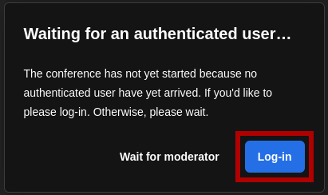

# User Guide: Creating a Jitsi Meeting in the Browser and Inviting Participants

## General Information
Jitsi is a free, open-source video conferencing solution that can be used directly in the browser. It allows you to easily create online meetings. Jitsi offers features such as screen sharing, chat, and the option to secure meetings with a password. To create a meeting, you need to log in. Other participants can join the meeting without an account.

## 1. Starting a Jitsi Meeting

### Step 1: Open Jitsi Meet
1. Open your web browser (e.g., Google Chrome, Mozilla Firefox, Microsoft Edge).
2. Go to the Jitsi Meet website: [https://meet.jit.si](https://meet.jit.si)

### Step 2: Create a New Meeting
1. On the homepage, you will see a field with a generated meeting name.

2. Enter a unique name for your meeting (e.g., “IKSDP-MEETING”).

3. Click **“Start Meeting”** or press the **Enter key**.

### Step 3: Grant Browser Permissions
1. If you are using Jitsi Meet for the first time, your browser will ask for access to your **microphone and camera**.
2. Allow access so you can participate in the video conference.

### Step 4: Set Your Name and Join the Meeting
1. You will now see an input box where you can enter your name.

2. You can then enable or disable your microphone  and camera .
3. Click the "Join Meeting" button to enter the video conference.  

### Step 5: Log in (only required for the Organizer)
1. You will now be prompted to log in to start the meeting.
2. Click "Log in".  

3. You can choose from different login providers. In this guide, we will use a Google account. Click the "Sign in with Google" button.  

4. Click on your account. If no account is already signed in, you will need to log in with your Google account first.  

5. Now click the "Continue" button.  

6. You should now be successfully logged in, and the video conference should start.  

---

## 2. Inviting Participants

### Step 1: Share the Meeting Link
1. Click the **“Invite People”** icon at the bottom right.  

2. A pop-up window will appear with the **meeting link**.
3. Copy this link and share it via **email, messenger, or other chat tools**.  

---

## 3. During the Meeting

### Controlling Microphone and Camera:
- **Mute microphone**: Click the **microphone icon** at the bottom.
- **Turn off camera**: Click the **camera icon** at the bottom.

### Screen Sharing:
1. Click the **screen sharing icon**.
2. Choose whether to share your entire screen, a window, or a tab.
3. Click **“Share”**.

### Ending the Meeting:
- Click the **red phone icon** to leave or end the meeting.

---

## Additional Tips
- Use the **chat** (bottom left) for notes or links.
- If you experience connection issues, switching to **Google Chrome** may help.
