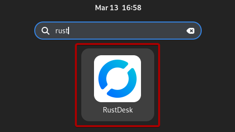
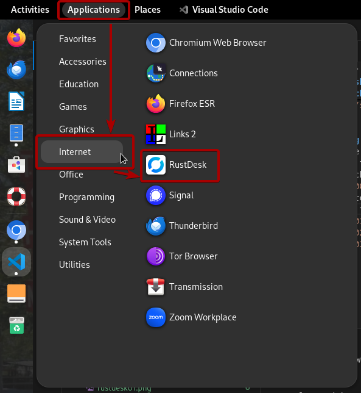
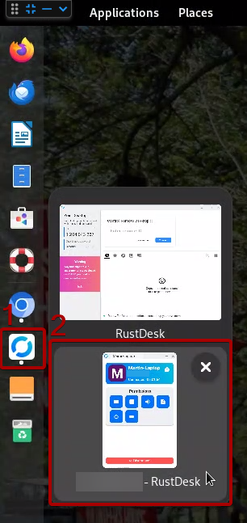

# Documentazione per utenti avanzati di IKSDP Desktop Linux  

## Creare una chiavetta USB per un utente  

TODO  

## Aggiornare il sistema operativo  

TODO

```bash
mount -t nfs 192.168.200.1:/usb2-part1 /mnt
dd if=/mnt/smb/debian-live* of=/dev/nvme0n1 status=progress 
```

## Supporto tramite Sessione Remota con Rustdesk

### Avviare una Sessione Remota  
1. Apri l'applicazione **"Rustdesk"** premendo il tasto **"Windows"** e iniziando a digitare **"Rustdesk"**.  
2. Ora fai clic sull'icona **"Rustdesk"**.  
  
3. Un altro modo per avviare Rustdesk è aprire la scheda Applicazioni nella barra delle applicazioni in alto e poi fare clic su **"Internet"** e **"Rustdesk"**.  
  
4. Ora invia il tuo **"ID"** e la tua **"One-time Password"**, che puoi vedere sulla sinistra, alla persona da cui vuoi ricevere supporto.  
  
5. Potrebbe apparire una piccola finestra che indica che un dispositivo vuole connettersi al tuo computer. Normalmente la connessione viene stabilita automaticamente. Se ciò non accade, fai clic sul pulsante **"Accept"**.  
  
6. Se è la prima volta che qualcuno si connette al tuo computer, dovrai selezionare lo schermo da condividere. Seleziona lo schermo, spunta la casella **"Remember this selection"** e poi fai clic su **"Share"**.  
  
7. Se vedi questa piccola icona nella barra delle applicazioni in alto, significa che la connessione è attiva.  
  

### Terminare la Sessione Remota  
1. Sposta il mouse sopra l'icona **"Rustdesk"** nella barra laterale sinistra. Ora dovrebbero apparire due piccole finestre accanto alla barra laterale.  
2. Fai clic sulla finestra che mostra la connessione attiva.  
  
3. Ora dovrebbe apparire sullo schermo la finestra **"Connessione"**.  
4. Fai clic su **"Disconnect"** per terminare la sessione remota.  
  
5. La piccola icona nella barra delle applicazioni in alto  dovrebbe ora scomparire, il che significa che la connessione è stata chiusa per il dispositivo remoto.