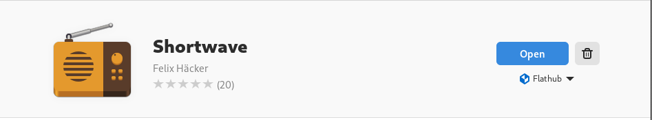

# Documentazione utente di IKSDP Desktop Linux  

## Destinatari del documento  

Questo documento è rivolto agli utenti di IKSDP Desktop Linux. Il sistema operativo è un sistema Linux live che supporta due diverse modalità operative:  
- [Modalità non persistente](#modalità-non-persistente)  
- [Modalità persistente](#modalità-persistente)  

È necessario scegliere una modalità operativa prima di avviare il sistema.  

## Avvio del sistema  

All'avvio del sistema, verrà visualizzata la seguente schermata:  

  

L'opzione predefinita è "Live system (amd64)". Se nessuna chiavetta USB è collegata al sistema prima dell'avvio, il sistema si avvierà in modalità non persistente. Se invece è stata collegata una chiavetta USB preparata prima dell'avvio, il sistema si avvierà in modalità persistente.  

Se la chiavetta USB viene collegata dopo la selezione dell'avvio, il sistema rimarrà in modalità non persistente. Per passare alla modalità persistente, sarà necessario riavviare il sistema.  

### Modalità non persistente  

Questa è la modalità predefinita. Può essere riconosciuta dalla dicitura "non-persistent" visualizzata in alto a destra sul desktop.  

  

In questa modalità è possibile apportare modifiche al sistema, ma tutte le modifiche verranno completamente ripristinate dopo un riavvio.  

Se durante una sessione utente vengono creati file che si desidera conservare, questi devono essere salvati su un dispositivo di archiviazione esterno come una chiavetta USB, un telefono o un servizio cloud.  

### Modalità persistente  

In questa modalità, le modifiche dell'utente vengono salvate su una chiavetta USB appositamente preparata. In questo modo, le impostazioni utente nei programmi, come i segnalibri del browser, i file e i programmi installati, rimarranno anche dopo il riavvio del sistema.  

  

> **La chiavetta USB non deve essere rimossa mentre il sistema è in modalità persistente, altrimenti si rischia la perdita di dati!**  

## Installazione di software aggiuntivo  

È possibile installare software aggiuntivo. In modalità non persistente, questa operazione deve essere ripetuta **ad ogni avvio del sistema**. Se si desidera installare software in modo permanente, contattare il proprio referente locale di IKSDP, che potrà effettuare l'installazione.  

Selezionare "System Tools" > "Software"  
  

Successivamente, cercare il software desiderato e selezionarlo. In questo esempio, stiamo cercando un'applicazione per la radio via Internet.  
  

Installare il software facendo clic sul pulsante "Install".  
Sotto il pulsante "Install" dovrebbe apparire la dicitura "Flatpak".  
  

L'installazione del software può richiedere un po' di tempo a seconda delle dimensioni del pacchetto. L'avanzamento dell'installazione verrà mostrato sotto il pulsante "Cancel". Se si desidera annullare l'installazione, premere il pulsante "Cancel".  
  

Una volta completata l'installazione, il software può essere avviato facendo clic su "Open".  
  

## Spegnimento del sistema  

Il sistema può essere spento facendo clic sul pulsante "Power" in alto a destra .  
Fare clic sul pulsante "Power" e quindi su "Power Off...".  
  

Si aprirà una finestra di dialogo "Power Off". Fare clic sul pulsante "Power Off" per spegnere il sistema.  
  