# Guida utente: Creare una riunione Jitsi nel browser e invitare partecipanti

## Informazioni generali
Jitsi è una soluzione gratuita e open-source per videoconferenze che può essere utilizzata direttamente nel browser. Ti consente di creare facilmente riunioni online. Jitsi offre funzionalità come la condivisione dello schermo, la chat e la possibilità di proteggere le riunioni con una password. Per creare una riunione, è necessario effettuare l'accesso. Gli altri partecipanti possono unirsi alla riunione senza un account.

## 1. Avviare una riunione Jitsi

### Passaggio 1: Aprire Jitsi Meet
1. Apri il tuo browser web (ad es. Google Chrome, Mozilla Firefox, Microsoft Edge).
2. Vai al sito web di Jitsi Meet: [https://meet.jit.si](https://meet.jit.si)

### Passaggio 2: Creare una nuova riunione
1. Nella pagina iniziale vedrai un campo con un nome di riunione generato automaticamente.
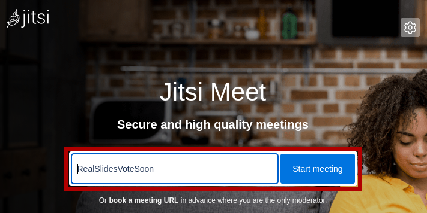
2. Inserisci un nome univoco per la tua riunione (es. "IKSDP-MEETING").
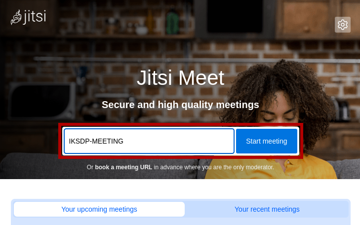
3. Clicca su **"Start Meeting"** o premi il **tasto Invio**.

### Passaggio 3: Concedere le autorizzazioni al browser
1. Se utilizzi Jitsi Meet per la prima volta, il tuo browser chiederà l'accesso a **microfono e fotocamera**.
2. Concedi l'accesso per poter partecipare alla videoconferenza.
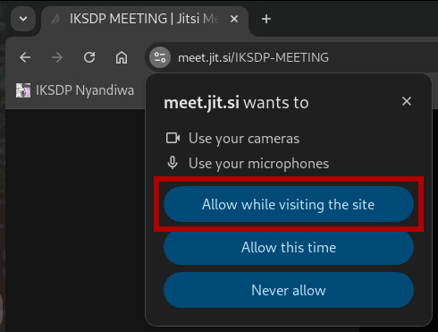

### Passaggio 4: Impostare il proprio nome e partecipare alla riunione
1. Ora vedrai una casella di input dove puoi inserire il tuo nome.
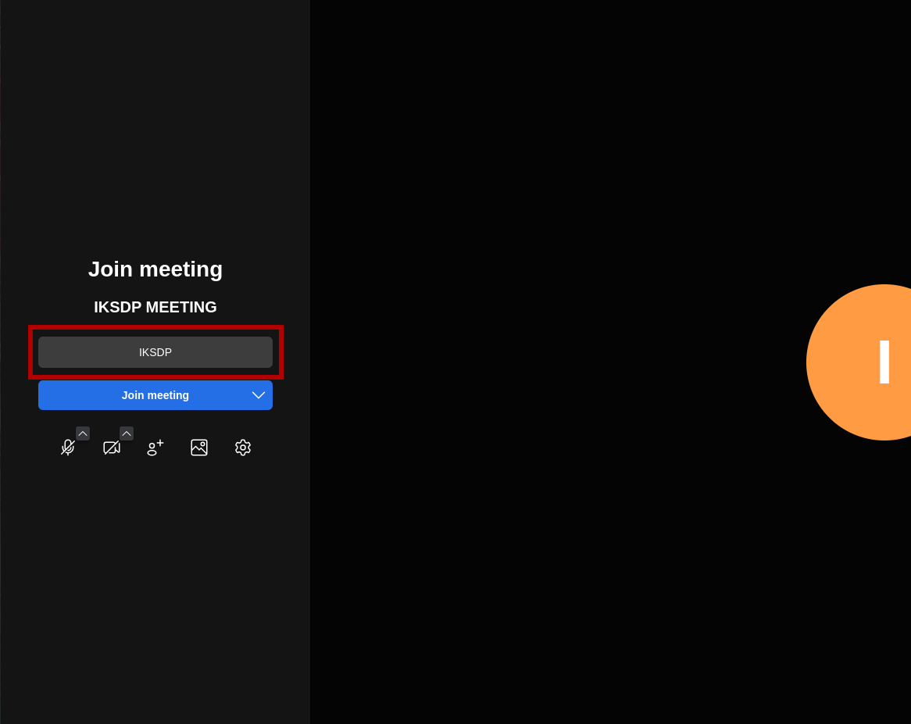
2. Puoi quindi attivare o disattivare il microfono 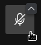 e la fotocamera 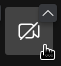.
3. Clicca sul pulsante "Join Meeting" per accedere alla videoconferenza.  

### Passaggio 5: Effettuare il login (Solo per il creatore della riunione)
1. Ti verrà richiesto di effettuare l'accesso per avviare la riunione.
2. Clicca su "Log in".  
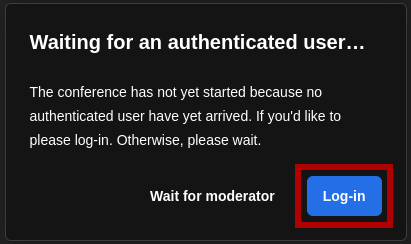
3. Puoi scegliere tra diversi provider di accesso. In questa guida utilizzeremo un account Google. Clicca sul pulsante "Sign in with Google".  
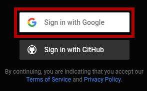
4. Seleziona il tuo account. Se nessun account è già connesso, dovrai accedere per la prima volta con il tuo account Google.  
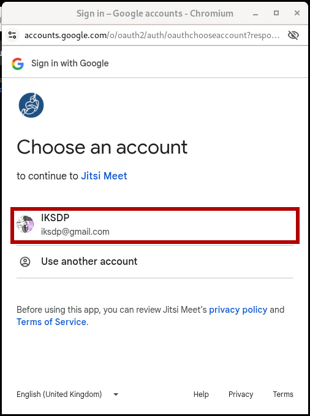
5. Ora clicca sul pulsante "Continue".  
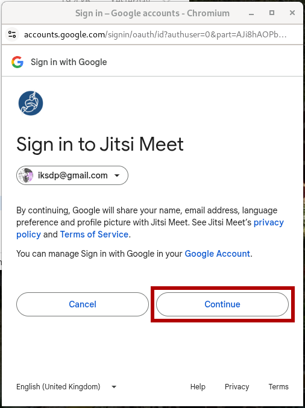
6. Ora dovresti essere connesso con successo e la videoconferenza dovrebbe iniziare.  
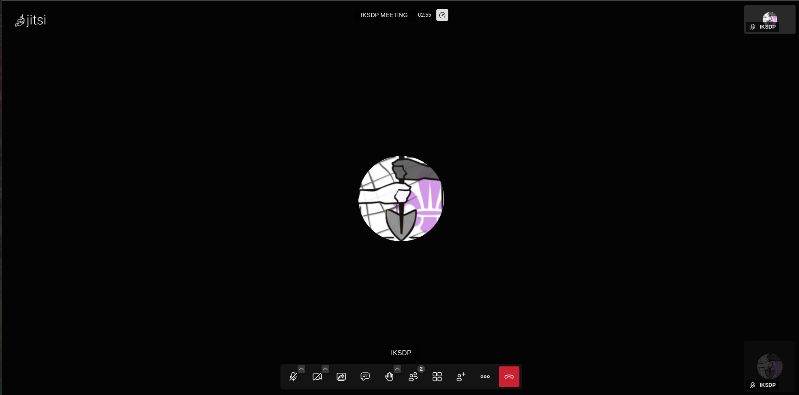
---

## 2. Invitare partecipanti

### Passaggio 1: Condividere il link della riunione
1. Clicca sull **icona "Invita persone"** in basso a destra.  

2. Apparirà una finestra pop-up con il **link della riunione**.
3. Copia questo link e condividilo tramite **email, messenger o altri strumenti di chat**.  
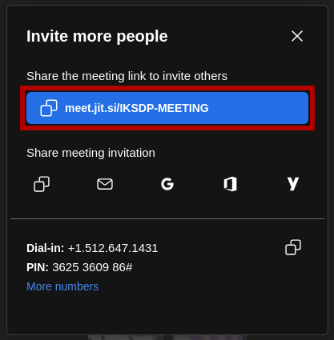

---

## 3. Durante la riunione

### Controllare il microfono e la fotocamera:
- **Disattivare il microfono**: Clicca sull **icona del microfono** in basso.
- **Disattivare la fotocamera**: Clicca sull **icona della fotocamera** in basso.

### Condivisione dello schermo:
1. Clicca sull **icona di condivisione dello schermo**.
2. Scegli se condividere l'intero schermo, una finestra o una scheda.
3. Clicca su **"Condividi"**.

### Terminare la riunione:
- Clicca sull **icona del telefono rosso** per uscire o terminare la riunione.

---

## Suggerimenti aggiuntivi
- Usa la **chat** (in basso a sinistra) per appunti o link.
- Se riscontri problemi di connessione, prova a passare a **Google Chrome**.